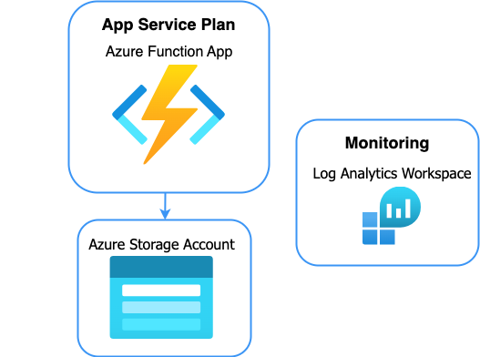

<!-- YAML front-matter schema: https://review.learn.microsoft.com/en-us/help/contribute/samples/process/onboarding?branch=main#supported-metadata-fields-for-readmemd -->

# FastAPI on Azure Functions

[](https://github.com/codespaces/new?hide_repo_select=true&ref=main&repo=449261589)
[](https://vscode.dev/redirect?url=vscode://ms-vscode-remote.remote-containers/cloneInVolume?url=https://github.com/Azure-Samples/fastapi-on-azure-functions)

Azure Functions supports ASGI-compatible frameworks with HTTP-triggered Python functions. This sample shows how to run a FastAPI app on Azure Functions using the Python v2 programming model and `func.AsgiFunctionApp`.

## Features
- FastAPI integration with Azure Functions
- Automatic OpenAPI/Swagger documentation
- Python async support
- Easy deployment to Azure with Azure Developer CLI
- Built-in monitoring with Application Insights

## Getting Started

### Prerequisites
- Python 3.9 or later
- Azure Developer CLI (azd)
- Visual Studio Code (recommended)

### Installation
1. Clone the repository.
2. Create a virtual environment:
   ```bash
   python -m venv .venv
   source .venv/bin/activate  # Linux/macOS
   .venv\Scripts\activate     # Windows
   ```
3. Install dependencies:
   ```bash
   pip install -r requirements.txt
   ```

## Architecture
The application uses a serverless architecture powered by Azure Functions:



## Region Availability
This template can be deployed to any Azure region that supports:
- Azure Functions with Python
- Application Insights
- Azure Storage

For the most up-to-date information on regional availability, visit the [Azure Products by Region](https://azure.microsoft.com/en-us/global-infrastructure/services/) page.

## Costs
The main cost components for this solution are:
- Azure Functions Flex Consumption plan (pay-per-execution)
- Azure Storage account
- Application Insights

Estimated costs for typical usage patterns:
- Development/Testing: $10-20/month
- Production (moderate load): $50-100/month

For detailed pricing, use the [Azure Pricing Calculator](https://azure.microsoft.com/en-us/pricing/calculator/).

## Security
This project implements several security best practices:
- HTTPS-only access
- Managed Identity support
- Application-level logging
- Secure default configurations

For security-related issues, please see our [Security Policy](SECURITY.md).

## Resources
- [FastAPI Documentation](https://fastapi.tiangolo.com/)
- [Azure Functions Python Developer Guide](https://learn.microsoft.com/azure/azure-functions/functions-reference-python)
- [Azure Developer CLI](https://learn.microsoft.com/azure/developer/azure-developer-cli/)
- [Contributing Guidelines](CONTRIBUTING.md)
- [Code of Conduct](CODE_OF_CONDUCT.md)

## Setup

Clone or download [this sample's repository](https://github.com/Azure-Samples/fastapi-on-azure-functions/), and open the `fastapi-on-azure-functions` folder in Visual Studio Code or your preferred editor.

## Using FastAPI Framework in an Azure Function App

The `requirements.txt` file includes the `fastapi` dependency alongside `azure-functions`.

```txt
azure-functions
fastapi
```

The `host.json` file sets `routePrefix` to an empty string so FastAPI routes are served directly.

```json
{
  "version": "2.0",
  "extensions": {
    "http": {
      "routePrefix": ""
    }
  }
}
```

The root folder contains `function_app.py`, which defines the FastAPI app and connects it to Azure Functions using `AsgiFunctionApp`:

```python
import azure.functions as func
from fastapi import FastAPI

fast_app = FastAPI()

@fast_app.get("/sample")
async def index():
    return {
        "info": "Try /hello/Shivani for parameterized route.",
    }

@fast_app.get("/hello/{name}")
async def get_name(name: str):
    return {
        "name": name,
    }

app = func.AsgiFunctionApp(app=fast_app, http_auth_level=func.AuthLevel.ANONYMOUS)
```

## Running the sample

### Testing locally
1. Create a [Python virtual environment](https://docs.python.org/3/tutorial/venv.html#creating-virtual-environments) and activate it.
2. Run the command below to install the necessary requirements.

   ```bash
   pip install -r requirements.txt
   ```

3. Start the app using your preferred Azure Functions development workflow, such as Visual Studio Code with the Azure Functions extension.
4. Once the function is running, try these URLs locally:

   ```text
   http://localhost:7071/sample
   http://localhost:7071/hello/YourName
   ```

### Deploying to Azure

Deploy this sample with the Azure Developer CLI:

1. Sign in if needed:
   ```bash
   azd auth login
   ```
2. Provision and deploy:
   ```bash
   azd up
   ```
3. Optionally configure CI/CD:
   ```bash
   azd pipeline config
   ```

This provisions a Function App, Storage account, and Log Analytics workspace.


### Testing in Azure

After deployment, test these paths on the deployed URL:

```text
https://<FunctionAppName>.azurewebsites.net/sample
https://<FunctionAppName>.azurewebsites.net/hello/Foo
```

You can call the URL endpoints using your browser (GET requests) or one of these HTTP test tools:

- [Visual Studio Code](https://code.visualstudio.com/download) with an [extension from Visual Studio Marketplace](https://marketplace.visualstudio.com/vscode)
- [PowerShell Invoke-RestMethod](https://learn.microsoft.com/powershell/module/microsoft.powershell.utility/invoke-restmethod)
- [Microsoft Edge - Network Console tool](https://learn.microsoft.com/microsoft-edge/devtools-guide-chromium/network-console/network-console-tool)
- [Bruno](https://www.usebruno.com/)
- [curl](https://curl.se/)
