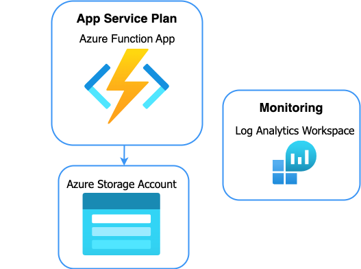

<!-- YAML front-matter schema: https://review.learn.microsoft.com/en-us/help/contribute/samples/process/onboarding?branch=main#supported-metadata-fields-for-readmemd -->

# Using FastAPI Framework with Azure Functions

Azure Functions supports WSGI and ASGI-compatible frameworks with HTTP-triggered Python functions. This can be helpful if you are familiar with a particular framework, or if you have existing code you would like to reuse to create the Function app. The following is an example of creating an Azure Function app using FastAPI.

## Prerequisites

You can develop and deploy a function app using either Visual Studio Code or the Azure CLI. Make sure you have the required prerequisites for your preferred environment:

* [Prerequisites for VS Code](https://docs.microsoft.com/azure/azure-functions/create-first-function-vs-code-python#configure-your-environment)
* [Prerequisites for Azure CLI](https://docs.microsoft.com/azure/azure-functions/create-first-function-cli-python#configure-your-local-environment)

## Setup

Clone or download [this sample's repository](https://github.com/Azure-Samples/fastapi-on-azure-functions/), and open the `fastapi-on-azure-functions` folder in Visual Studio Code or your preferred editor (if you're using the Azure CLI).

## Using FastAPI Framework in an Azure Function App

The code in the sample folder has already been updated to support use of the FastAPI. Let's walk through the changed files.

The `requirements.txt` file has an additional dependency of the `fastapi` module:

```
azure-functions
fastapi
```


The file host.json includes the a `routePrefix` key with a value of empty string.

```json
{
  "version": "2.0",
  "extensions": {
    "http": {
        "routePrefix": ""
    }
  }
}
```


The root folder contains `function_app.py` which initializes an `AsgiFunctionApp` using the imported `FastAPI` app:

```python
import azure.functions as func

from WrapperFunction import app as fastapi_app

app = func.AsgiFunctionApp(app=fastapi_app, http_auth_level=func.AuthLevel.ANONYMOUS)
```

In the `WrapperFunction` folder, the `__init__.py` file defines a FastAPI app in the typical way (no changes needed):

```python
import azure.functions as func

import fastapi

app = fastapi.FastAPI()

@app.get("/sample")
async def index():
    return {
        "info": "Try /hello/Shivani for parameterized route.",
    }


@app.get("/hello/{name}")
async def get_name(name: str):
    return {
        "name": name,
    }
```

## Running the sample

### Testing locally

1. Create a [Python virtual environment](https://docs.python.org/3/tutorial/venv.html#creating-virtual-environments) and activate it.

2. Run the command below to install the necessary requirements.

    ```log
    python3 -m pip install -r requirements.txt
    ```

3. If you are using VS Code for development, click the "Run and Debug" button or follow [the instructions for running a function locally](https://docs.microsoft.com/azure/azure-functions/create-first-function-vs-code-python#run-the-function-locally). Outside of VS Code, follow [these instructions for using Core Tools commands directly to run the function locally](https://docs.microsoft.com/azure/azure-functions/functions-run-local?tabs=v4%2Cwindows%2Cpython%2Cportal%2Cbash#start).

4. Once the function is running, test the function at the local URL displayed in the Terminal panel:
=======
```log
Functions:
        http_app_func: [GET,POST,DELETE,HEAD,PATCH,PUT,OPTIONS] http://localhost:7071//{*route}
```

    ```log
    Functions:
            WrapperFunction: [GET,POST] http://localhost:7071/{*route}
    ```

    Try out URLs corresponding to the handlers in the app, both the simple path and the parameterized path:

    ```
    http://localhost:7071/sample
    http://localhost:7071/hello/YourName
    ```

### Deploying to Azure

There are three main ways to deploy this to Azure:

* [Deploy with the VS Code Azure Functions extension](https://docs.microsoft.com/en-us/azure/azure-functions/create-first-function-vs-code-python#publish-the-project-to-azure). 
* [Deploy with the Azure CLI](https://docs.microsoft.com/en-us/azure/azure-functions/create-first-function-cli-python?tabs=azure-cli%2Cbash%2Cbrowser#create-supporting-azure-resources-for-your-function).
* Deploy with the Azure Developer CLI: After [installing the `azd` tool](https://learn.microsoft.com/en-us/azure/developer/azure-developer-cli/install-azd?tabs=localinstall%2Cwindows%2Cbrew), run `azd up` in the root of the project. You can also run `azd pipeline config` to set up a CI/CD pipeline for deployment.

All approaches will provision a Function App, Storage account (to store the code), and a Log Analytics workspace.



### Testing in Azure

Once deployed, test different paths on the deployed URL, using either a browser or a tool like Postman.

```
http://<FunctionAppName>.azurewebsites.net/sample
http://<FunctionAppName>.azurewebsites.net/hello/Foo
```

## Next Steps

Now you have a simple Azure Function App using the FastAPI framework, and you can continue building on it to develop more sophisticated applications.

To learn more about leveraging WSGI and ASGI-compatible frameworks, see [Web frameworks](https://docs.microsoft.com/azure/azure-functions/functions-reference-python?tabs=asgi%2Cazurecli-linux%2Capplication-level#web-frameworks).
